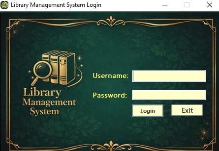

📚 Library Management System

A Java-based Library Management System designed to manage books, borrowers, staff, and transactions efficiently. This application provides an organized way to handle library operations such as issuing and returning books, user management, and record tracking.

-------------------------------------------------------------------------------------------------------------------------------------------------------------------------------------------------------------------------------------------------------------------

🚀 Features

📖 Book Management (Add, Update, Delete)

👤 User & Borrower Management

🧑‍💼 Staff Management

🔄 Issue & Return Books

📋 Borrowed & Issued Book Tracking

📜 History Logs

🔐 Login System

🖥️ Admin & Staff Interfaces

-------------------------------------------------------------------------------------------------------------------------------------------------------------------------------------------------------------------------------------------------------------------

🛠️ Technologies Used

Java (JDK 8+)

IDE (Netbeans 8.2 ver)

Swing (GUI)

JDBC (Database Connectivity)

Relational Database (MariaDB)

-------------------------------------------------------------------------------------------------------------------------------------------------------------------------------------------------------------------------------------------------------------------

🔐 Default Roles

Admin

Full access to system

-Add user,

-Add books,

-monitor borrowed/returned items.

-view history logs and statistics.

Staff

Limited access to system

-add borrower.

-issueing book.

-returning book.

-------------------------------------------------------------------------------------------------------------------------------------------------------------------------------------------------------------------------------------------------------------------

👨‍💻 Author

ArielBazar

GitHub: https://github.com/Arielbazar

-------------------------------------------------------------------------------------------------------------------------------------------------------------------------------------------------------------------------------------------------------------------

## Project Introduction

This project is a Library Management System developed using Netbeans GUI 8.2 ver, Java 8 and MariaDB.

The first stage of the system is a login module, where users must enter a valid username and password.
The credentials are checked against the database to authenticate users before granting access to the system.

This feature helps ensure security and proper access control for admin and staff users.
